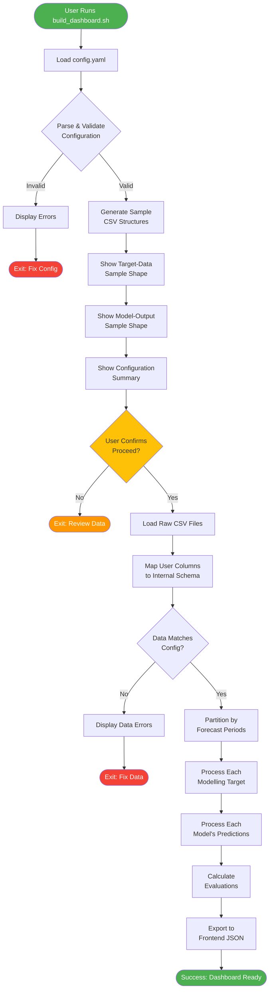

# Overall dashboard-building workflow flowchart

# Spatial Data Multi-Scenario Decision Matrix

| Scenario | disable_map | custom_shape_file example | custom_location_mapping example | Validation        | Result                                   | Use Case                                                          |
| -------- | ----------- | ----------------- | ----------------------- | ----------------- | ---------------------------------------- | ----------------------------------------------------------------- |
| **A**    | `False`     | `null`            | `null`                  | ✅ PASS           | Default US States map + FIPS codes       | Standard US state-level forecasting                               |
| **B**    | `False`     | `null`            | `"custom.csv"`       | ⚠️ PASS + WARNING | Default US shape + Custom location names | Custom display names for US states (must use FIPS codes in data)  |
| **C**    | `False`     | `"counties.json"` | `null`                  | ❌ ERROR          | Configuration error                      | Invalid: Custom shapes require custom mapping                     |
| **D**    | `False`     | `"counties.json"` | `"county_mapping.csv"`  | ✅ PASS           | Custom shape + Custom mapping            | County/district/custom spatial level forecasting                  |
| **E**    | `True`      | `null`            | `null`                  | ✅ PASS           | No map, default FIPS dropdown            | Dropdown-only interface with US states                            |
| **F**    | `True`      | `null`            | `"custom.csv"`          | ✅ PASS           | No map, custom locations dropdown        | Dropdown-only with custom locations (e.g., hospitals, facilities) |
| **G**    | `True`      | `"any.json"`      | `null`                  | ℹ️ INFO           | No map, default FIPS dropdown            | Shape file ignored (map disabled)                                 |
| **H**    | `True`      | `"any.json"`      | `"custom.csv"`          | ℹ️ INFO           | No map, custom locations dropdown        | Shape file ignored (map disabled)                                 |
